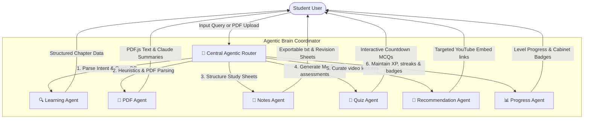

# Vidyaverse AI 2.0 🚀
> **Personalized Client-Side Learning Universe & Gamified Study Companion**

[](https://vercel.com)
[](https://developer.mozilla.org/en-US/docs/Web/JavaScript)
[](https://developer.mozilla.org/en-US/docs/Web/CSS)
[](https://www.kaggle.com)
[](https://developer.mozilla.org/en-US/docs/Web/Progressive_web_apps)

Vidyaverse AI 2.0 is a premium, client-side, offline-first gamified study workspace and structured search engine designed for Indian students preparing for competitive national entrance exams (Class 10, Class 12, JEE, NEET, CUET, and CA Foundation). 

Designed to combat academic fatigue, high subscription barriers, and bloated, ad-ridden alternatives, Vidyaverse AI 2.0 is completely free, secure, runs locally in the browser, and stores all user data in a private local sandbox.

---

## 📌 Problem Statement

Students preparing for high-stakes Indian exams (JEE, NEET, Board exams) face immense cognitive load, expensive paywalls, and scattered study resources. Popular online portals contain aggressive advertisements, track user sessions, require complex cloud servers, and lack gamified mechanics that reinforce daily study habits. 

---

## 💡 The Solution: Vidyaverse AI 2.0

Vidyaverse AI 2.0 provides a single, distraction-free environment that functions offline-first, requiring no database registrations, user logins, or backend servers. It leverages the client's browser capability for fuzzy-search lookup, text-extraction, and API integration.

### Core Upgraded Capabilities in v2.0:
*   **Comprehensive Knowledge Database**: Replaced random mockup responses with a structured JSON curriculum consisting of **50 genuine, highly detailed chapters** across Physics, Chemistry, Mathematics, Biology, CA Foundation Accounting, and CUET Quantitative Aptitude.
*   **Smart Fuzzy Search**: A custom search engine that combines exact matching, substring overlap, token overlap, and **Levenshtein character-distance matching** to resolve typos and aliases (e.g., searching `"Coulomb Law"`, `"Coulomb's Law"`, or `"Electrostatic Force"` all successfully map to the same Electrostatics chapter).
*   **10-Part Interactive Study Guide**:
    *   *Topic Overview & Theoretical Explanations*
    *   *Key Concepts* (Rendered in an interactive grid)
    *   *Glossary & Definitions*
    *   *Formula Chest* (Contains equations and variables)
    *   *Interactive Flashcards* (Flippable Q&A widget with progress indicators)
    *   *Concept Assessment Quiz* (Immediate visual validation with scoring and detailed explanations)
    *   *Syllabus Learning Path* (A visual timeline of progression)
    *   *Knowledge Graph* (Navigation cards to related chapters)
    *   *Common Mistakes & Exam Tips*
    *   *Suggested Video Lectures* (Curated educational video cards with channels, durations, and thumbnails)
*   **E2E PDF Summarizer**: Dynamically pulls `PDF.js` library from CDN, extracts text page-by-page, shows real progress indicators, matches text patterns to database topics, and falls back to a smart heuristic summarizer (building summaries, terms, formulas, and tips from raw text).
*   **Claude 3.5 Sonnet Integration**: Integrates Anthropic's message endpoints directly into the client-side browser using `anthropic-dangerous-direct-browser-access` headers, allowing users to safely query real AI summaries of uploaded files using their private API keys.
*   **Bulletproof Safety & Loading Audit**: All asynchronous operations (Notes & PDF generation) run within a **10 to 15-second timeout protection** and are wrapped in robust `try/catch/finally` blocks, guaranteeing that loading overlays always close and interface buttons are re-enabled.

---

## 🤖 Agentic Architecture (Hackathon ADK Concept)

Vidyaverse AI 2.0 models its modular views after a client-side multi-agent network, coordinated by a central routing dispatcher.

### Workflow Diagram



### Agent Roles & Workspaces:
1.  **Central Agentic Router** (`js/router.js`): Intercepts hash changes, extracts URL queries, clears rendering panels, and dispatches parameters to relevant agents.
2.  **Learning Agent** (`js/views/learnView.js`): Connects user queries to the fuzzy search resolver, matching terms and preparing the 10-part student study layout.
3.  **Notes Agent** (`js/views/notesView.js`): Synthesizes text blocks in four configurations (Quick Notes, Detailed Notes, Revision Sheet, and Exam Checklist) and exports summaries as downloadable `.txt` files.
4.  **PDF Agent** (`js/views/pdfView.js`): Runs page-by-page browser text extraction, checks keyword frequency matches against the curriculum, and hooks into Claude 3.5 Sonnet for custom summaries.
5.  **Quiz Agent** (`js/views/quizView.js`): Manages timed multiple-choice question boards, calculates accuracy, and updates the competitive rankings board.
6.  **Progress Agent** (`js/store.js` & `js/gamification.js`): Manages levels, check-in streaks, daily objective completions, and unlocks achievement badges.

---

## 🔌 Model Context Protocol (MCP) Server Integration Blueprint

To fulfill the **MCP Server** capability of the capstone course, we have designed a Node.js/TypeScript-based MCP server setup (`vidyaverse-mcp-server`) that exposes Vidyaverse AI's local chapter curriculum and user notes to external LLMs and IDE agents (like Claude Desktop or Gemini).

### How it works:
The MCP server exposes:
*   `vidyaverse://chapters/list`: Returns list of 50 chapters from the database.
*   `vidyaverse://chapters/{topic}`: Retrieves specific chapter formulas, glossary, and flashcards.
*   `vidyaverse://notes/{title}`: Allows local agents to read or edit student notes saved on disk.

### Implementation Code (`mcp/server.ts`):
```typescript
import { Server } from "@modelcontextprotocol/sdk/server/index.js";
import { StdioServerTransport } from "@modelcontextprotocol/sdk/server/stdio.js";
import {
  ListResourcesRequestSchema,
  ReadResourceRequestSchema,
} from "@modelcontextprotocol/sdk/types.js";
import * as fs from "fs";
import * as path from "path";

const DATABASE_PATH = path.resolve("./data/educational_database.json");

const server = new Server(
  {
    name: "vidyaverse-study-server",
    version: "2.0.0",
  },
  {
    capabilities: {
      resources: {},
    },
  }
);

// Define Resources Schema
server.setRequestHandler(ListResourcesRequestSchema, async () => {
  const db = JSON.parse(fs.readFileSync(DATABASE_PATH, "utf-8"));
  return {
    resources: db.map((ch: any) => ({
      uri: `vidyaverse://chapters/${ch.topic.toLowerCase().replace(/\s+/g, "-")}`,
      name: `${ch.topic} Study Material`,
      mimeType: "application/json",
      description: `Syllabus guide and formulas for ${ch.topic}`,
    })),
  };
});

server.setRequestHandler(ReadResourceRequestSchema, async (request) => {
  const uri = new URL(request.params.uri);
  const topicParam = uri.pathname.split("/").pop();
  
  const db = JSON.parse(fs.readFileSync(DATABASE_PATH, "utf-8"));
  const matched = db.find(
    (ch: any) => ch.topic.toLowerCase().replace(/\s+/g, "-") === topicParam
  );

  if (!matched) {
    throw new Error(`Topic ${topicParam} not found in Vidyaverse Database`);
  }

  return {
    contents: [
      {
        uri: request.params.uri,
        mimeType: "application/json",
        text: JSON.stringify(matched, null, 2),
      },
    ],
  };
});

async function main() {
  const transport = new StdioServerTransport();
  await server.connect(transport);
}

main().catch(console.error);
```

---

## 🔒 Security & Sandbox Features

Vidyaverse AI 2.0 is built around strict data privacy and student security:
1.  **Zero Backend Data Collection**: All study logs, notes, levels, and badges are stored on the student's browser sandbox via `localStorage`. No analytical telemetry or trackers are active.
2.  **API Key Safety**: If the user inputs an Anthropic API Key for PDF parsing:
    *   The key is stored strictly within the client's local browser memory.
    *   It is **never** transmitted to any middleman server or proxy.
    *   Requests are sent *directly* from the browser origin to Anthropic's secure endpoints.
    *   There is no risk of backend credential leaks.
3.  **Timeout & Error Protections**: Async file parses and API calls are guarded by a client-side timeout wrapper (`withTimeout`). If an operation takes longer than 10-15 seconds, the promise is automatically aborted, and loading spinners are dismantled to prevent browser locks.

---

## 🕹️ Gamification Rules & Formulas

*   **Leveling Formula**: 
    $$\text{Level} = \lfloor \frac{\text{XP}}{1000} \rfloor + 1$$
*   **XP Accrual Rates**:
    *   *Perform a Universal Study Search*: $+20$ XP (First search reward: $+100$ XP)
    *   *Generate Custom Study Notes*: $+50$ XP
    *   *Upload & Summarize a PDF*: $+75$ XP
    *   *Answer an MCQ question correctly*: $+20$ XP
    *   *Complete a Quiz Arena session*: $+150$ XP
    *   *Daily Check-in Streak*: 🔥 Increases daily
    *   *Complete Daily Goal* (1 search + 1 quiz in 24 hrs): $+250$ XP bonus

---

## 📂 Project Organization

```text
/
├── index.html                  # Main Single-Page-Application workspace shell
├── script.js                   # Application coordinator & router initializer
├── vercel.json                 # Vercel static routing & cache headers configuration
├── README.md                   # Capstone project documentation
├── css/
│   └── style.css               # Theme design system, layout, and visual components
├── data/                       # Local Curriculum Database resources
│   ├── educational_database.json # 50-topic highly detailed curriculum database
│   ├── class10.json            # Chapter MCQ maps (Class 10 Science)
│   ├── class12.json            # Chapter MCQ maps (Class 12 Physics/Chemistry)
│   ├── jee.json                # Chapter MCQ maps (JEE Physics/Math)
│   ├── neet.json               # Chapter MCQ maps (NEET Biology)
│   ├── cuet.json               # Chapter MCQ maps (CUET Quantitative)
│   ├── cafoundation.json       # Chapter MCQ maps (CA Accounting)
│   └── career.json             # Career roadmap timelines JSON
└── js/                         # JavaScript source modules
    ├── store.js                # Game state management & API key storage
    ├── gamification.js         # XP points, daily goal calculations, and badges cabinet
    ├── router.js               # Client-side hash router
    ├── ui.js                   # Theme handlers, toast messages, and celebration overlays
    ├── mockSearch.js           # Search resolver (fuzzy matches, aliases, suggestions)
    └── views/                  # View rendering controllers
        ├── homeView.js         # Landing page search autocomplete & architecture visualizer
        ├── learnView.js        # Upgraded study workspace (flashcards, assessments)
        ├── notesView.js        # AI notes editor workspace with text exports
        ├── pdfView.js          # Upgraded PDF summarizer with progress bar & Claude API
        ├── quizView.js         # Timed MCQ player & rankings board
        ├── dashboardView.js    # Habit dashboard with CSS weekly bar charts
        └── settingsView.js     # User renames, badges cabinet, data backup & reset
```

---

## 🚀 Local Development

To run the application locally without hitting CORS browser safety blocks for local JSON imports:

1.  Clone or download the project files.
2.  Open your terminal in the project directory and start a web server:
    ```bash
    
    # Using Node.js
    npx live-server
    ```
3.  Open **`http://localhost:8000`** in your browser.

---


