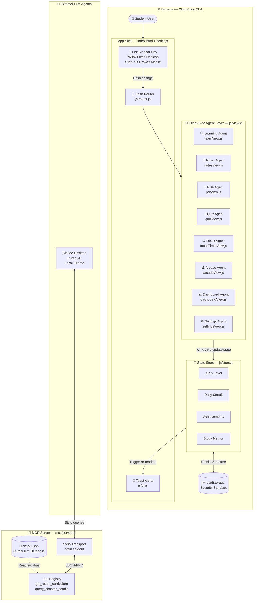
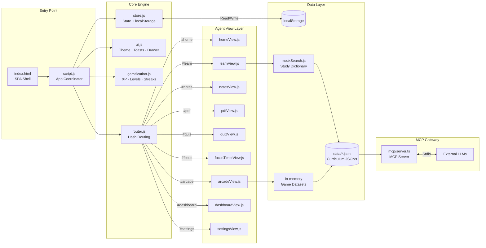
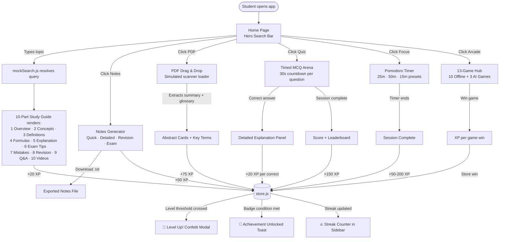
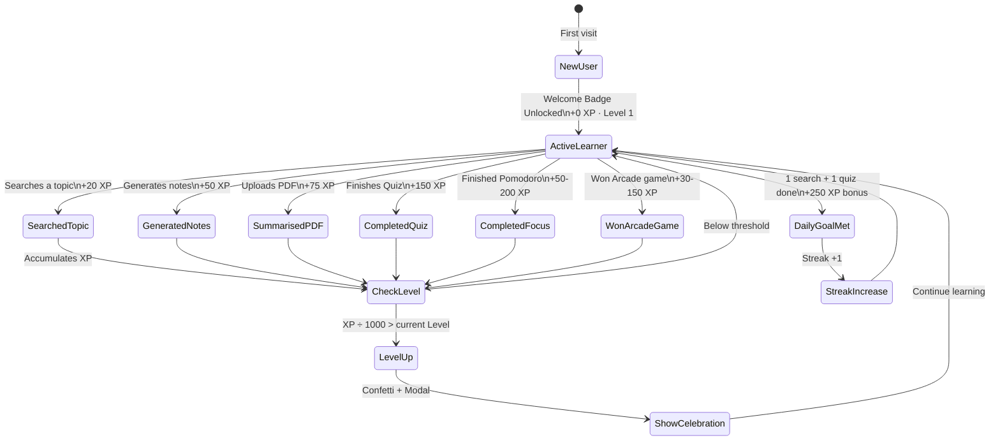
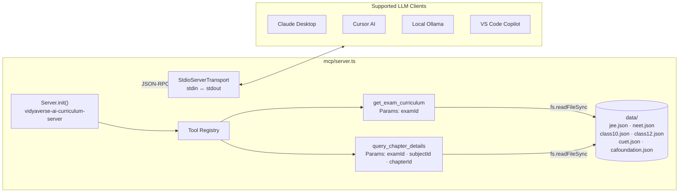

# Vidyaverse AI — Implementation Plan

---

## 1. Problem Statement

Indian students preparing for JEE, NEET, CUET, and Board exams face:
- 📚 Massive cognitive load from unstructured textbook content
- 💸 Expensive edtech subscription paywalls
- 🕵️ Privacy violations from data-harvesting platforms
- 😴 Burnout from passive reading without gamified reinforcement loops

**Vidyaverse AI** solves all four problems with a free, offline-first, browser-based study workspace powered by client-side AI agents.

---

## 2. High-Level System Architecture



---

## 3. Module Architecture — File-Level Flowchart



---

## 4. User Interaction Flow



---

## 5. Gamification State Machine



---

## 6. MCP Server Architecture



---

## 7. Kaggle Evaluation Criteria Mapping

| Criterion | Where Implemented | Score Weight |
|---|---|---|
| **Agent / Multi-agent System (ADK)** | `js/views/*.js` — 9 independent client-side agents coordinated by `script.js` | Code |
| **MCP Server** | `mcp/server.ts` with Stdio transport, `get_exam_curriculum` & `query_chapter_details` tools | Code |
| **Security Features** | `js/store.js` — zero external calls, localStorage sandbox, export/import JSON backup | Code + Video |
| **Deployability** | `vercel.json` — deployed as static SPA on Vercel, zero build steps needed | Video |
| **Antigravity** | Built with Antigravity AI tool (this session) | Video |
| **Agent Skills** | `js/gamification.js` — XP accrual, streak, badges as persistent agent memory | Code + Video |

---

## 8. File Structure Summary

```
vidyaverse-ai/
├── index.html              ← SPA Shell (sidebar + view panels)
├── script.js               ← App coordinator (routing + sidebar sync)
├── vercel.json             ← Vercel static deployment config
├── README.md               ← Full product documentation
│
├── css/
│   └── style.css           ← Design tokens, dark/light mode, charts
│
├── data/                   ← Curated curriculum JSON databases
│   ├── class10.json
│   ├── class12.json
│   ├── jee.json
│   ├── neet.json
│   ├── cuet.json
│   └── cafoundation.json
│
├── mcp/
│   └── server.ts           ← MCP server (Stdio transport + tool registry)
│
└── js/
    ├── store.js            ← State + localStorage sandbox
    ├── gamification.js     ← XP, levels, streaks, badges
    ├── router.js           ← Hash-based SPA router
    ├── ui.js               ← Theme, toasts, confetti, mobile drawer
    ├── mockSearch.js       ← Study search dictionary + 10-part resolver
    └── views/
        ├── homeView.js         ← Search console + AI agent visualizer
        ├── learnView.js        ← 10-part study guide renderer
        ├── notesView.js        ← Notes builder + .txt exporter
        ├── pdfView.js          ← PDF scanner + summary output
        ├── quizView.js         ← Timed MCQ arena + leaderboard
        ├── focusTimerView.js   ← Pomodoro / Deep Work / Sprint timer
        ├── arcadeView.js       ← 13-game educational hub
        ├── dashboardView.js    ← Radial XP ring + weekly chart
        └── settingsView.js     ← Profile + export/import + badges
```
